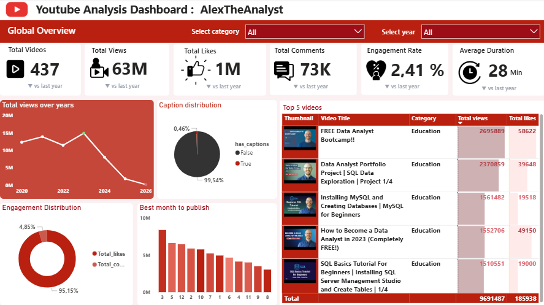

# 📊 YouTube Data Pipeline

## 📌 Contexte
Ce projet consiste à construire un pipeline de données à partir de l’API YouTube Data v3.
Objectif : extraire, transformer et analyser des données YouTube afin de produire un dataset exploitable dans Power BI.

## 🎯 Objectifs
- Interroger une API REST (YouTube)
- Manipuler des données JSON
- Gérer la pagination
- Construire un pipeline ETL simple
- Produire un dataset propre
- Créer un dashboard Power BI

## 🧱 Architecture
YouTube API → Extraction Python → JSON → Transformation → CSV → Power BI

## 🪜 Étapes

### 1. Setup
- Installer Python
- Créer un environnement virtuel
- Installer : requests, pandas, python-dotenv

### 2. API YouTube
- Créer un projet Google Cloud
- Activer YouTube Data API v3
- Générer une clé API

### 3. Sécurité
Créer un fichier `.env` :
YOUTUBE_API_KEY=your_api_key
Ajouter `.env` dans `.gitignore`

### 4. Extraction
- Récupérer la playlist d’une chaîne
- Extraire les videoId
- Gérer la pagination

### 5. Données vidéos
- titre
- date
- vues
- likes
- commentaires
- durée

### 6. Transformation
- JSON → DataFrame
- Nettoyage des données
- Conversion des formats

### 7. Stockage
df.to_csv("data/youtube_data.csv", index=False)

### 8. Visualisation
- Import dans Power BI
- Dashboards : vues, engagement, top vidéos

## 🛠️ Technologies
Python, Pandas, Requests, Power BI, YouTube API

## ✅ Résultat
Pipeline complet :
- Extraction des données
- Transformation
- Dataset exploitable
- Visualisation

## Dashboard Screenshots

| Youtube Analysis Dashboard |
